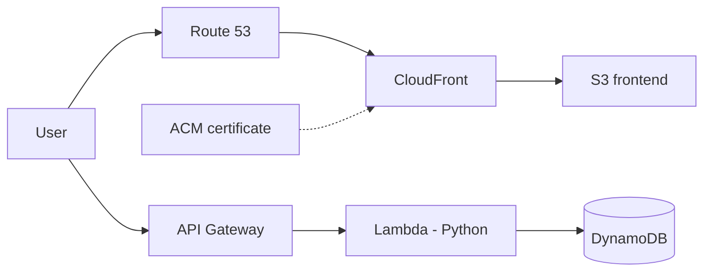

# FlowForge Architecture

```mermaid
flowchart LR
    User --> R53[Route 53]
    R53 --> CF[CloudFront]
    ACM[ACM certificate] -.-> CF
    CF --> S3[S3 frontend]
    User --> APIGW[API Gateway]
    APIGW --> LAMBDA[Lambda - Python]
    LAMBDA --> DDB[(DynamoDB)]
```
